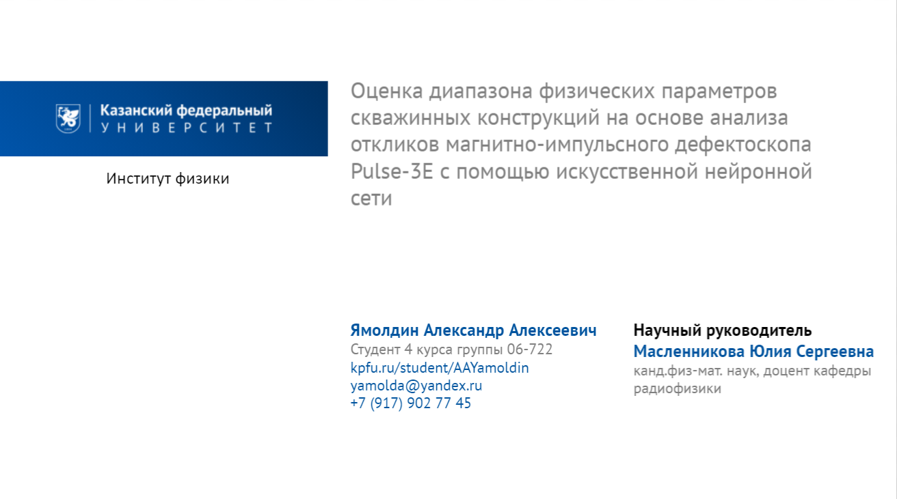
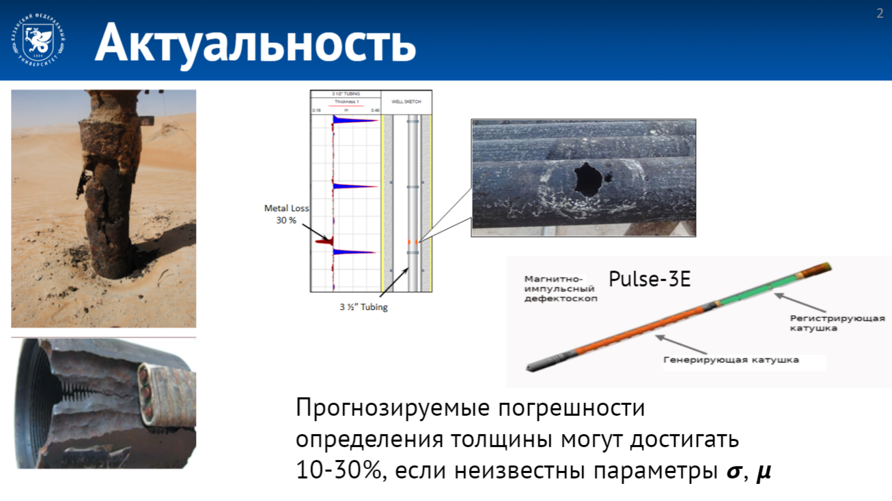
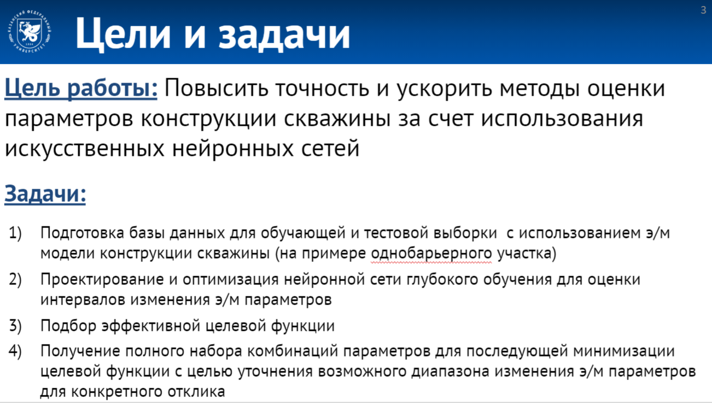
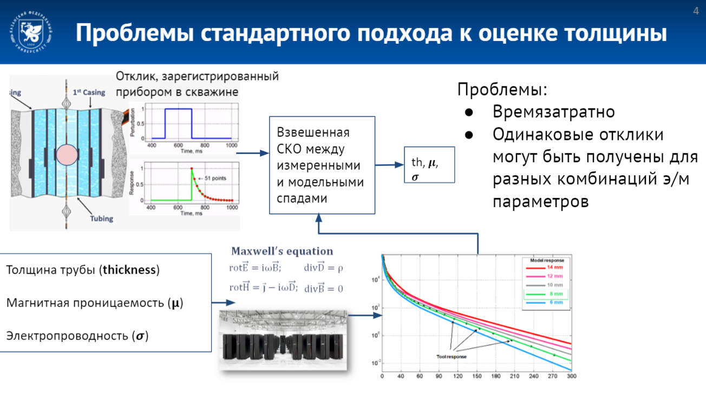
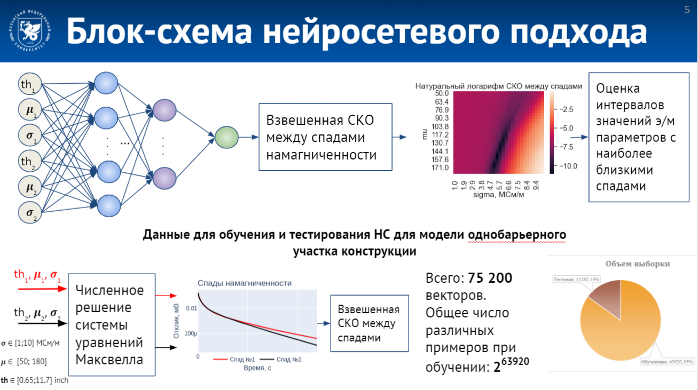
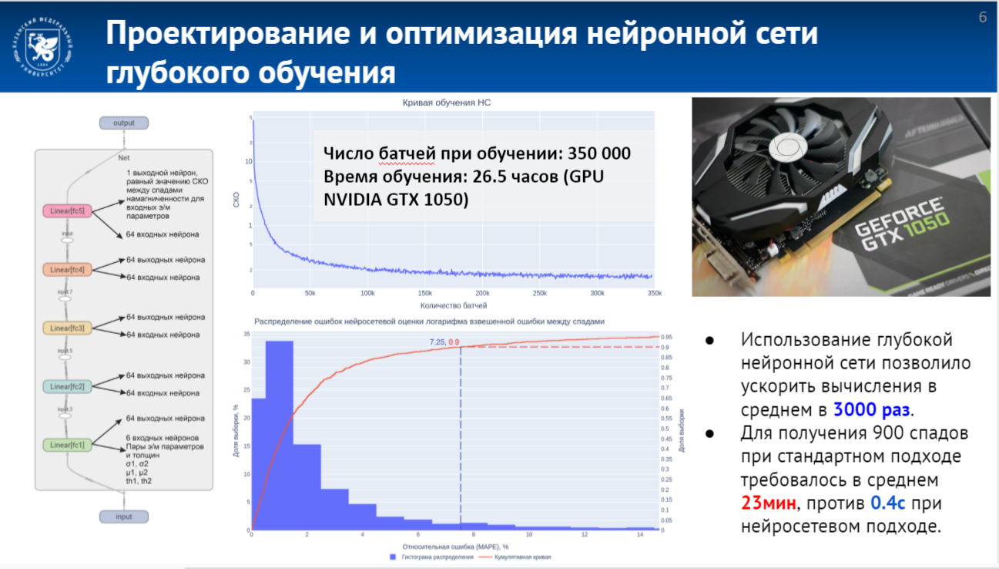
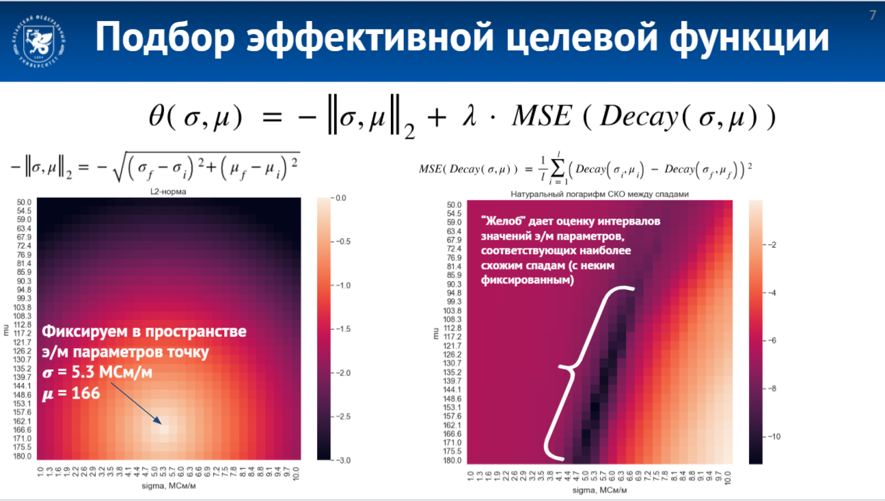
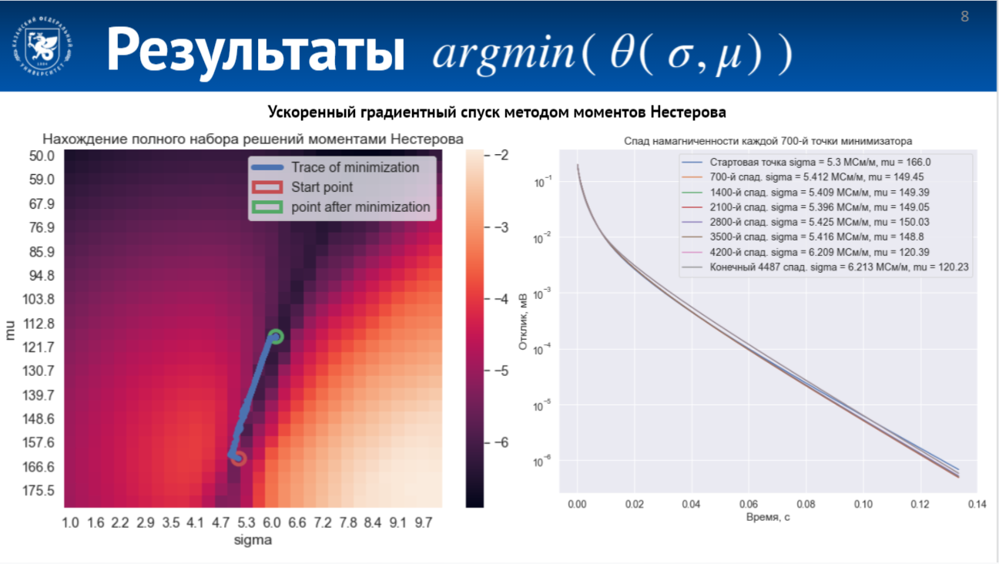
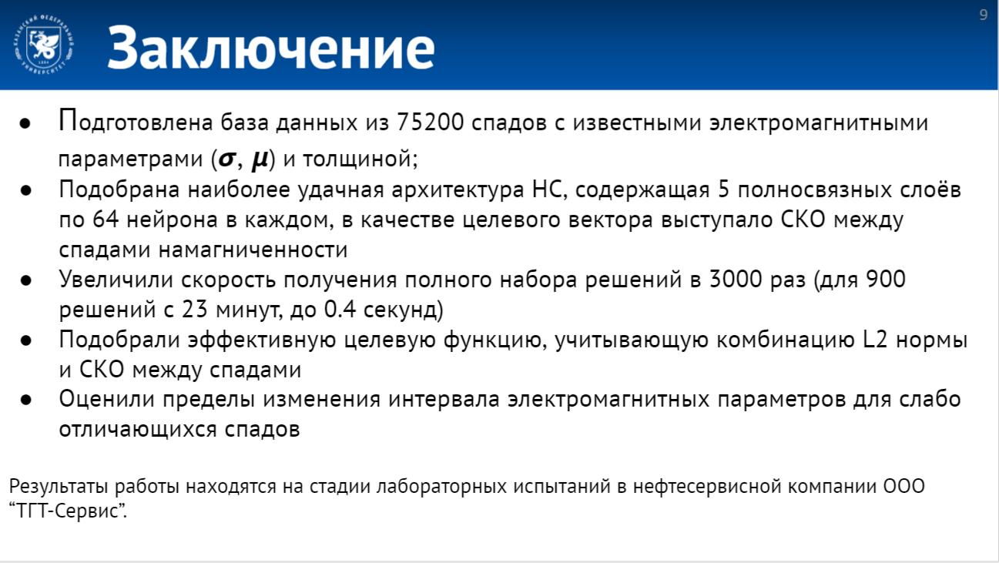

## ВЫПУСКНАЯ КВАЛИФИКАЦИОННАЯ РАБОТА

# ОЦЕНКА ДИАПАЗОНА ФИЗИЧЕСКИХ ПАРАМЕТРОВ СКВАЖИННЫХ КОНСТРУКЦИЙ НА ОСНОВЕ АНАЛИЗА ОТКЛИКОВ МАГНИТНО-ИМПУЛЬСНОГО ДЕФЕКТОСКОПА PULSE-3E С ИСПОЛЬЗОВАНИЕМ ИСКУССТВЕННОЙ НЕЙРОННОЙ СЕТИ

#####

## Авторы

### :boy: Ямолдин Александр Алексеевич
####        :email: [AAYamoldin@gmail.com](aayamoldin@gmail.com)

### :woman: [Масленникова Юлия Сергеевна](https://kpfu.ru/juliya.maslennikova)

## Опубликованные материалы и результаты
#### :page_facing_up: [Статья](https://kmu.itmo.ru/digests/article/7374) в сборнике тезисов Х Конгресса молодых ученых
#### :tada: [Диплом победителя](./Pictures/README/KMU.png) в [конкурсе докладов](https://abit.itmo.ru/page/178/) X Конгресса молодых ученых 

###

#### :page_facing_up: Статья в [сборнике тезисов](https://smit-conference.ru/wp-content/uploads/2021/06/smit_broshure_2021_web.pdf) [Молодежной конференции по математическому моделированию и информационным технологиям SMIT](https://smit-conference.ru/)
#### :tada: [Диплом победителя](./Pictures/README/SMIT.png) в [Молодежной конференции по математическому моделированию и информационным технологиям SMIT](https://smit-conference.ru/)

###

#### :page_facing_up: Статья в [сборнике тезисов]() [итоговой научно-образовательной конференции студентов Казанского Федерального Университета 2021]()
#### :page_facing_up: Статья в [сборнике статей]() [итоговой научно-образовательной конференции студентов Казанского Федерального Университета 2021]()
#### :tada: [Диплом победителя](./Pictures/README/KFU_best.png) в Конкурсе на лучшую научную работу студентов КФУ 2021г. по инженерно-техническому направлению.

###

#### В планах публикация научной статьи

# Краткий обзор проделанной работы
#### Слайд 1. Основная информация

#### Слайд 2. Актуальность работы

Нефтяные скважины состоят из металлических колонн. Со временем конструкции скважины изнашиваются, появляются интервалы коррозий, которые потом перерастают в сквозные нарушения, способные нанести большой экологический и экономический вред путем выхода в окружающую среду нефти или газа. Поэтому одной из ключевых задач в обслуживании скважин является поиск коррозионных нарушений. Магнитная дефектоскопия используется как один из ключевых методов неразрушающего контроля поиска коррозий. Суть метода заключается в том, что электромагнитный дефектоскоп, в нашем случае это дефектоскоп pulse-3E, разработанный нефтесервисной компанией “ТГТ-сервис”, двигаясь внутри скважины, каждые 15см с помощью генерирующей катушки намагничивает колонну, а c помощью второй - регистрирующей катушки, регистрирует спад намагниченности. В соответсвии с решением системы электромагнитных уравнений Максвелла, интенсивность спада намагниченности зависит от толщины стенки трубы, т.о. является возможным определить толщину трубы при анализе спада. Особенностью решения Максвелловской системы является получение одних и тех же спадов намагниченности при различных комбинациях электромагнитных параметров, вследствии наличия в решении произведения электропроводности-сигма на магнитопроницаемость-мю и толщину стенки скважины. Поэтому, чтобы перебрать всевозможные значения э/м параметров необходимо многократно осуществлять решение системы уравнений Максвелла. Такой подход, во-первых, очень времязатратен, во-вторых, при неизвестных параметрах магнитопроницаемости и электропроводности, погрешность в определении толщины может достигать нескольких миллиметров.
#### Слайд 3. Цели и задачи

Поэтому перед нами встала цель: Повысить точность и ускорить методы оценки параметров конструкции скважины за счет использования искусственных нейронных сетей. 
Для этого были решены следующие задачи:

* Подготовка базы данных для обучающей и тестовой выборки

* Проектирование и оптимизация нейронной сети 

* Подбор эффективной целевой функции

* Получение полного набора с целью уточнения возможного диапазона изменения э/м параметров для конкретного отклика
#### Слайд 4. Проблемы стандартного подхода к оценке толщины

На данном слайде демонстрируется стандартный подход к оценке толщины. Труба намагничивается прямоугольным импульсом, синяя линия на верхнем графике, после прекращения намагничивания фиксируется экспериментальный спад намагниченности - зеленая линия. Далее запускается модельная функция расчета в которой перебираются различные комбинации значений электромагнитных параметров, с помощью суперкомпьютеров многократно решается система электромагнитных уравнений Максвелла в результате вычисляются модельные спады намагниченности, далее эти спады сравниваются со спадом с детектора (экспериментальным спадом), после чего определяется максимально похожий модельный спад к спаду детектора и, соответственно, используют те параметры, которые дали на модели этот похожий к экспериментальному спад.
У этого подхода существуют минимум две большие проблемы: 
* Численное решение системы уравнений Максвелла это очень времязатратный процесс. Даже при наличии суперкомпьютера время получения 1 решения обратной задачи может занимать от единиц до десятков минут. В случае, когда существует необходимость получить спектр возможных комбинаций эм параметров (т.е. многократно решая обратную задачу из разных начальных приближений), время решения задачи может достичь нескольких часов, что неприемлемо
* Второй проблемой, как мы уже сказали, является то, что для одного спада может существовать несколько наборов комбинаций электромагнитных параметров, поэтому важно иметь полный набор решений для дальнейшего выбора наиболее близких к априорным данным параметров.
#### Слайд 5. Блок схема нейросетевого подхода

Суть предложенного нами подхода заключается в избегании решения системы электромагнитных уравнений Максвелла. Мы получаем метрику разности между спадами (СКО), минуя расчет модельного отклика. Благодаря использованию нейросети у нас появляется возможность за небольшое время получить полный набор оценок разности откликов при различных комбинациях электромагнитных параметров. На тепловой карте видно, что у нас существует желоб, соответствующий минимальным различиям откликов друг с другом при различных комбинациях э/м параметров. Это как раз покатель того, что для различных комбинаций э/м параметров у нас действительно есть фактически одни и те же спады
При решении задачи первый шаг состоял из подготовки сета данных на которых мы будем обучать и тестировать нашу нейронную сеть. Комбинации электромагнитных параметров в пределах от  {1 до 10 млн См/м} для электропроводности, от 50 до 180 для магнитной проницаемости, и от 0,65 до 11,7 дюймов для толщины подавались на вход модели однобарьерного участка конструкции, внутри модели решались уравнения Максвелла и на выходе получался спад намагниченности. Эту процедуру мы повторили 75тысяч раз. Перемешали данные и произвели стандартную нормировку на нулевое мат ож и единичную дисперсию . Разделили на обучающую и тестовую выборку в пропорции примерно 6 к 1. Обратите внимание, что Переобучение сети исключено гигантским количеством различных вариантов для обучения.
#### Слайд 6. Проектирование и оптимизация нейронной сети глубокого обучения

Архитектура нейронной сети представляет собой самописную на PyTorch пятислойную полносвязную сеть по 64 нейрона в каждом внутреннем слое. На вход нейронной сети всего подавалось 6 параметров, два триплета толщин, магнитных проницаемостей и электропроводностей, а на выходе получали среднеквадратическую ошибку между спадами намагниченности, удовлетворяющими этим параметрам. Верхний график это кривая обучения нейронной сети. Мы обучались бесконечным циклом до того момента, пока кривая обучения не выйдет на полочку, т.е. сеть не достигнет максимума своей обобщающей способности. Обучение заняло около 350 000 батчей и около 26,5 часов времени. Результат обучения сети представлен гистограммой распределения ошибок (синим цветом) и, красным цветом, кумулятивной кривой(или, как её еще называют, интегральной кривой) по 1000 случайно выбранным элементам тестовой выборки, можно сказать, что с доверительным интервалом в два сигма (примерно 95,5% всех значений выборки) ошибка лежит в пределах 14%, более того, по кумулятивной кривой видно, что в 90% случаев ошибка не превышает 7,3%
Такая точность нас устраивает и мы считаем нашу сеть достаточно обученной для дальнейшего её применения в исследовании. Я хочу обратить Ваше внимание на очень важный промежуточный вывод, применение нейросетевого подхода ускорило время вычислений в около 3000раз. С 23 минут до менее чем полусекунды для получения набора из 900 параметров.
#### Слайд 7. Подбор эффективной целевой функции

После того как мы убедились в корректной работе нейросети можно переходить к получению полного набора решений для различных электромагнитных параметров. Идея в том, чтобы получить максимально похожие спады при разных значениях э/м параметров. Это нужно для того, чтобы при анализе откликов из скважин, исходя априорных сведений, к примеру, о металле, выбрать подходящую нам комбинацию. Зафиксируем точку в пространстве sigma/mu и посмотрим на составляющие целевой функции. Она состоит из L2-нормы и ошибки между спадами. Отрицательная L2 норма, она же Евклидово расстояние представляет собой параболоид развернутый вниз из-за знака минус, логарифм ошибки между спадами представляет собой ухабистую поверхность, где четко прослеживается желоб минимума: это те значения электромагнитных параметров в которых спады отличаются наименьше всего. Лямбда является гиперпараметром,  который показывает соотношение значимости между потерями и расстоянием между параметрами.  Главная задача теперь - минимизировать функционал. То есть постараться максимально отойти от фиксированных значений sigma/mu, но при этом оставаться внутри желоба ошибки. Составленная нами целевая функция позволяет это сделать, поскольку, с одной стороны, отдаляясь от фиксированной точки мы уменьшаем функцию в связи с отрицательной L2 нормой, т.е. чем больше расстояние, тем более отрицательное значение получается под функционалом, с другой стороны, чем дальше мы отдаляемся от фиксированной точки, тем больше отличны между собой спады, поэтому ошибка возрастает. Таким образом, единственным выходом при минимизации является пройти строго по желобу.
#### Слайд 8. Результаты

Минимизация осуществлялась несколькими градиентными методами такими как классический градиентный спуск с постоянным шагом, метод доверительных областей и ускоренный градиентный спуск методом моментов нестерова.
К наиболее интересным результатом мы пришли с помощью метода моментов Нестерова. На хитмапе слева представлена история прохождения минимизатором по желобу функционала ошибки, можно видеть, что мы действительно находимся внутри минимума целевой функции, справа я вывел спады намагниченности для каждой 700-й точки трэйса минимизатора. Можно видеть, что у нас получилось 4487 различных комбинаций э/м параметров для практически не отличающихся спадов намагниченности. , а это значит, что мы достигли задачи, мы получили мультизначность решений для одного и того же спада, далее нам, как аналитикам, исходя из априорных данных нужно будет выбрать наиболее верное решение из диапазона, тем самым увеличив точность определения толщин. Это мы планируем реализовать в следующих наших исследованиях. 
#### Слайд 9. Заключение

#### Слайд 10. Финальный
